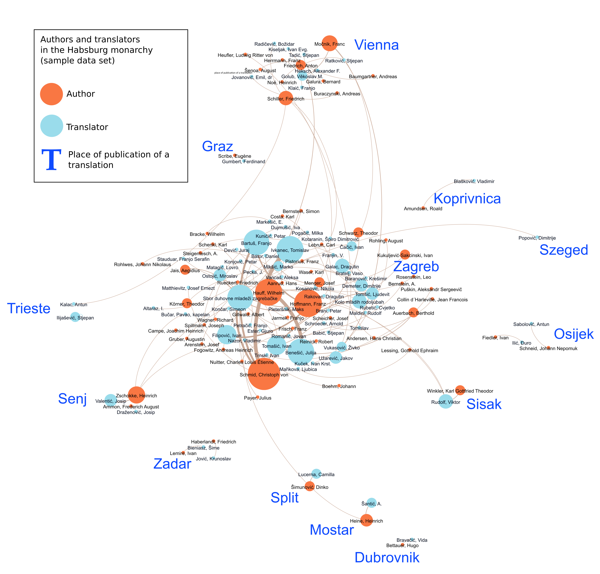

## Translation Spaces: Circulation of Knowledge in the Habsburg Monarchy between 1848 and 1918

Project coordinator: <a href="https://homepage.uni-graz.at/de/philipp.hofeneder/" title="Philipp Hofeneder website" target="_blank">Philipp Hofeneder</a>

This project is currently in development.

a) Network visualization of the sample data set of authors and translators in the Habsburg Monarchy <a title="Open image in new tab" href="https://sanjasaric.github.io/HaDUe/authors_translators_places_legend.png" target="_blank">↗</a>, Sanja Sarić 2021, CC-BY-SA

b) Thematic map about Friedrich Hauenschild (1783-1830) <a title="Open image in new tab" href="https://sanjasaric.github.io/HaDUe/Hauenschild3.jpg" target="_blank">↗</a>, Philipp Hofeneder 2021, CC-BY-SA

